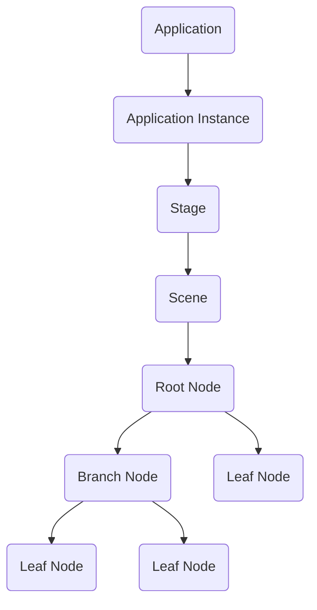
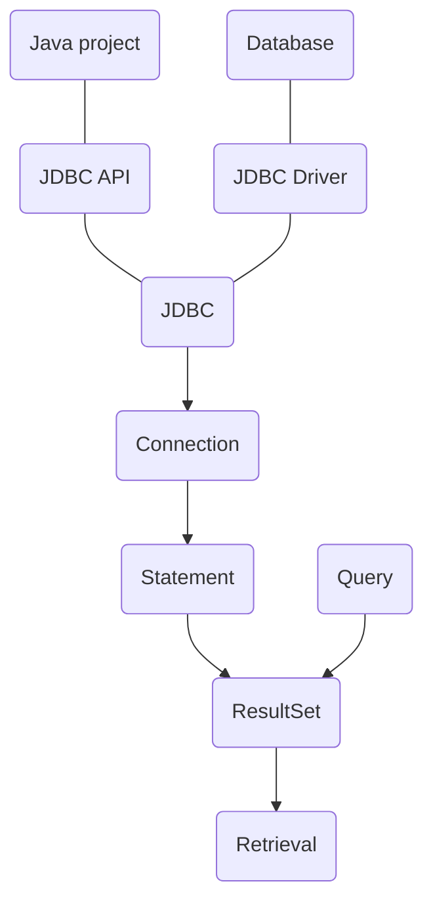
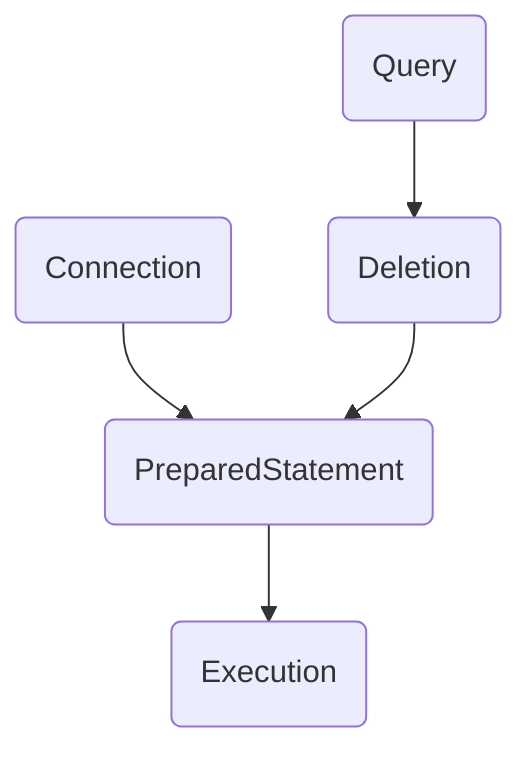
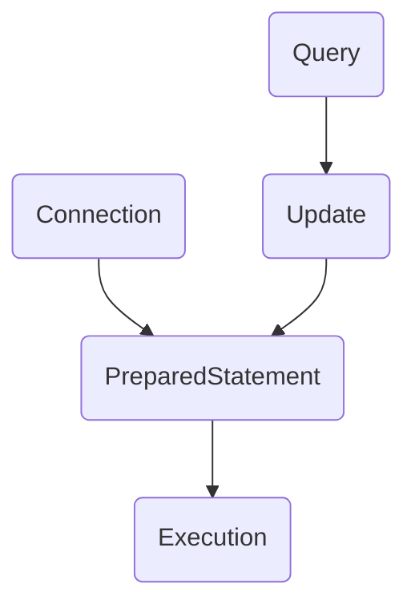
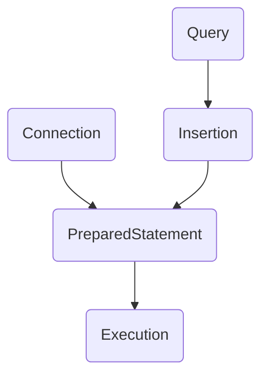

# **Description**

This file consists of theoretical questions regarding the Java programming language.

## **Theoretical Questions**

- [Description](#description)
  - [Theoretical Questions](#theoretical-questions)
    - [1. Define JVM (Java Virtual Machine)](#1-define-jvm-java-virtual-machine)
    - [2. Define JDK (Java Development Kit)](#2-define-jdk-java-development-kit)
    - [3. Define primitive data types](#3-define-primitive-data-types)
    - [4. Compare primitive data types and objects](#4-compare-primitive-data-types-and-objects)
    - [5. Explain why Java is regarded as cross-platform language](#5-explain-why-java-is-regarded-as-cross-platform-language)
    - [6. Define thread](#6-define-thread)
    - [7. Write down the methods of creating a thread in Java](#7-write-down-the-methods-of-creating-a-thread-in-java)
    - [8. Define the life cycle of a thread](#8-define-the-life-cycle-of-a-thread)
    - [9. Define encapsulation](#9-define-encapsulation)
    - [10. Define inheritance](#10-define-inheritance)
    - [11. Define polymorphism](#11-define-polymorphism)
    - [12. Define stack](#12-define-stack)
    - [13. Define heap](#13-define-heap)
    - [14. Define garbage collection](#14-define-garbage-collection)
    - [15. Define constructor](#15-define-constructor)
    - [16. Compare class methods and class members](#16-compare-class-methods-and-class-members)
    - [17. Define package](#17-define-package)
    - [18. Compare final classes and abstract classes](#18-compare-final-classes-and-abstract-classes)
    - [19. Define exceptions](#19-define-exceptions)
      - [Checked exception](#checked-exception)
      - [Unchecked exception](#unchecked-exception)
      - [Error](#error)
    - [20. Write down the methods of handling exceptions](#20-write-down-the-methods-of-handling-exceptions)
    - [21. Define interface](#21-define-interface)
    - [22. Compare interfaces and abstract classes](#22-compare-interfaces-and-abstract-classes)
      - [Summary](#summary)
      - [Alternative summary](#alternative-summary)
    - [23. Compare public and protected modificators](#23-compare-public-and-protected-modificators)
      - [Public](#public)
      - [Protected](#protected)
      - [Default](#default)
      - [Private](#private)
    - [24. Compare public and default modificators](#24-compare-public-and-default-modificators)
    - [25. Compare stack and heap](#25-compare-stack-and-heap)
    - [26. Compare FileWriter and BufferedWriter classes](#26-compare-filewriter-and-bufferedwriter-classes)
    - [27. Define the thread scheduler](#27-define-the-thread-scheduler)
    - [28. Write down the dangers of working with threads](#28-write-down-the-dangers-of-working-with-threads)
    - [29. Compare List and Set collection interfaces](#29-compare-list-and-set-collection-interfaces)
    - [30. Explain the workflow of an ArrayList (adding, erasing, altering, finding its elements)](#30-explain-the-workflow-of-an-arraylist-adding-erasing-altering-finding-its-elements)
    - [31. Compare LinkedList and ArrayList](#31-compare-linkedlist-and-arraylist)
    - [32. Define Socket and ServerSocket](#32-define-socket-and-serversocket)
    - [33. Explain the usage scenario of Socket objects](#33-explain-the-usage-scenario-of-socket-objects)
    - [34. Define Iterator](#34-define-iterator)
    - [35. Write down the types of objects which are leveraged for message streaming via Socket connections](#35-write-down-the-types-of-objects-which-are-leveraged-for-message-streaming-via-socket-connections)
    - [36. Define JavaFX](#36-define-javafx)
    - [37. Explain the process of creating an application using JavaFX](#37-explain-the-process-of-creating-an-application-using-javafx)
    - [38. Explain the functionality of the Scene object inside JavaFX](#38-explain-the-functionality-of-the-scene-object-inside-javafx)
    - [39. Define JDBC](#39-define-jdbc)
    - [40. Explain the process of querying data using JDBC](#40-explain-the-process-of-querying-data-using-jdbc)
    - [41. Explain the process of erasing data through JDBC using PreparedStatement object](#41-explain-the-process-of-erasing-data-through-jdbc-using-preparedstatement-object)
    - [42. Explain the process of editing data through JDBC using PreparedStatement object](#42-explain-the-process-of-editing-data-through-jdbc-using-preparedstatement-object)
    - [43. Explain the process of inserting data through JDBC using Statement object](#43-explain-the-process-of-inserting-data-through-jdbc-using-statement-object)

### **1. Define JVM (Java Virtual Machine)**

A Java virtual machine (JVM) is a virtual machine that enables a computer to run Java programs as well as programs written in other languages that are also compiled to Java bytecode.

### **2. Define JDK (Java Development Kit)**

The JDK forms an extended subset of a software development kit (SDK) and it is a superset of JRE (Java Runtime Environment). It includes "tools for developing, debugging, and monitoring Java applications".

### **3. Define primitive data types**

Primitive data types are the most basic data types available within the Java language. Such types serve only one purpose — containing pure, simple values of a kind. Because these data types are defined into the Java type system by default, they come with a number of operations predefined. You can not define a new operation for such primitive types. A primitive type is predefined by the language and is named by a reserved keyword. Primitive values do not share state with other primitive values.

### **4. Compare primitive data types and objects**

If primitives were atoms, - objects would have been molecules. Primitive types require less memory allocations in comparison to objects.

Local primitives are stored on the stack, while objects alongside their own primitives are stored on the heap.

### **5. Explain why Java is regarded as cross-platform language**

Java is cross platform in the sense that a compiled Java program runs on all platforms for which there exists a JVM.

Java compilation can also be done on multiple platforms, which makes Java inherently cross-platform.

### **6. Define thread**

A thread is a thread of execution in a program. The JVM (Java Virtual Machine) allows an application to have multiple threads of execution running concurrently. Threads can be seen as light-weight processes within a process.

### **7. Write down the methods of creating a thread in Java**

There are two ways to create a new thread of execution.

One is to declare a class to be a subclass of Thread. This subclass should override the run method of class Thread. An instance of the subclass can then be allocated and started.

The other way to create a thread is to declare a class that implements the Runnable interface. That class then implements the run method. An instance of the class can then be allocated, passed as an argument when creating Thread, and started.

### **8. Define the life cycle of a thread**

- New - a new thread is created.
- Runnable - the thread is ready to be run.
- Running - the thread of execution is running.
- Waiting - the thread waits for another process to finish.
- Dead - the thread has ceased to exist.

### **9. Define encapsulation**

Encapsulation in Java is a mechanism of wrapping the data (variables) and code acting on the data (methods) together as a single unit. In encapsulation, the variables of a class will be hidden from other classes, and can be accessed only through the methods of their current class.

### **10. Define inheritance**

Inheritance can be defined as the process where one class acquires the properties (methods and fields) of another. With the use of inheritance the information is made manageable in a hierarchical order.

The class which inherits the properties of other is known as subclass (derived class, child class) and the class whose properties are inherited is known as superclass (base class, parent class).

### **11. Define polymorphism**

Polymorphism is the ability of an object to take on many forms. The most common use of polymorphism in OOP occurs when a parent class reference is used to refer to a child class object.

There are two methods to achieve polymorphism in Java, - overloading and overriding.

Overloading occurs when two or more methods in one class have the same method name but different parameters.

Overriding means having two methods with the same method name and parameters (i.e., method signature). One of the methods is in the parent class and the other is in the child class. Overriding allows a child class to provide a specific implementation of a method that is already provided its parent class.

### **12. Define stack**

Each Java virtual machine thread has a private Java virtual machine stack, created at the same time as the thread. A Java virtual machine stack stores frames.

A Java virtual machine stack is analogous to the stack of a conventional language such as C: it holds local variables and partial results, and plays a part in method invocation and return. Because the Java virtual machine stack is never manipulated directly except to push and pop frames, frames may be heap allocated.

### **13. Define heap**

The Java virtual machine has a heap that is shared among all Java virtual machine threads. The heap is the runtime data area from which memory for all class instances and arrays is allocated.

The heap is created on virtual machine start-up. Heap storage for objects is reclaimed by an automatic storage management system (known as a garbage collector); objects are never explicitly deallocated.

The heap may be of a fixed size or may be expanded as required by the computation and may be contracted if a larger heap becomes unnecessary. The memory for the heap does not need to be contiguous.

A Java virtual machine implementation may provide the programmer or the user control over the initial size of the heap, as well as, if the heap can be dynamically expanded or contracted, control over the maximum and minimum heap size.

### **14. Define garbage collection**

In Java, garbage means unreferenced objects.

Garbage Collection is the process of reclaiming the unused memory of the runtime automatically. In other words, it is a way to destroy the unreferenced objects.

### **15. Define constructor**

A class contains constructors that are invoked to create objects from the class blueprint. Constructor declarations look like method declarations—except that they use the name of the class and have no return type.

### **16. Compare class methods and class members**

Class members belong to class and not the instances of the class. Class methods are a subset of class members and they can be defined as static methods which can be invoked through the class itself.

### **17. Define package**

A Java package is a group of similar types of classes, interfaces and sub-packages. Package in Java can be categorized in two form, built-in package and user-defined package.

### **18. Compare final classes and abstract classes**

- Final class - a type of class that can be instantiated, but cannot be extended
- Abstract class - a type of class that cannot be instantiated, but can be extended

### **19. Define exceptions**

An exception is an event that occurs during the execution of a program that disrupts the normal flow of instructions. The Java programming language uses exceptions to handle errors and other exceptional events.

There are three types of exceptions:

1. Checked exception
2. Unchecked exception
3. Error

#### Checked exception

The classes which directly inherit Throwable class except RuntimeException and Error are known as checked exceptions e.g. IOException, SQLException etc. Checked exceptions are checked at compile-time.

#### Unchecked exception

The classes which inherit RuntimeException are known as unchecked exceptions e.g. ArithmeticException, NullPointerException, ArrayIndexOutOfBoundsException etc. Unchecked exceptions are not checked at compile-time, but they are checked at runtime.

#### Error

Error is irrecoverable e.g. OutOfMemoryError, VirtualMachineError, AssertionError etc.

### **20. Write down the methods of handling exceptions**

- Try/catch/finally
- Throwing

### **21. Define interface**

An interface is a reference type in Java. It is similar to class. It is a collection of abstract methods. A class implements an interface, thereby inheriting the abstract methods of the interface.

Along with abstract methods, an interface may also contain constants, default methods, static methods, and nested types. Method bodies exist only for default methods and static methods.

Writing an interface is similar to writing a class. But a class describes the attributes and behaviors of an object. And an interface contains behaviors that a class implements.

Unless the class that implements the interface is abstract, all the methods of the interface need to be defined in the class.

### **22. Compare interfaces and abstract classes**

#### Summary

1. An interface defines a contract that some implementation will fulfill for you.
2. An abstract class provides a default behavior that your implementation can reuse.

#### Alternative summary

1. An interface is for defining public APIs (Application Programming Interface)
2. An abstract class is for internal use, and for defining SPIs (Service Provider Interfaces)

### **23. Compare public and protected modificators**

Public, protected, default, private in sequence.

| Class | Package | Subclass | Anywhere |
| :---: | :-----: | :------: | :------: |
|   +   |    +    |    +     |    +     |
|   +   |    +    |    +     |          |
|   +   |    +    |          |          |
|   +   |         |          |          |

#### Public

Accessible from everywhere.

#### Protected

Accessible by the classes of the same package and the subclasses residing in any package.

#### Default

Accessible by the classes of the same package.

#### Private

Accessible within the same class only.

### **24. Compare public and default modificators**

- Public - accessible from everywhere.
- Default - accessible by the classes of the same package.

### **25. Compare stack and heap**

Stack and heap are the memory segments used in memory allocation techniques. The primary difference between Stack and heap is that stack involves linear and sequential allocation of the memory which is used in static memory allocation whereas heap acts as a pool of storage area that allocated the memory randomly (Dynamic memory allocation).

Speed is the major parameter which distinguishes stack and heap; a stack is significantly faster than a heap.

### **26. Compare FileWriter and BufferedWriter classes**

Both BufferedReader and BufferedWriter in java are classified as buffered I/O streams. Buffered input streams read data from a memory area known as a buffer; the native input API is called only when the buffer is empty. Similarly, buffered output streams write data to a buffer, and the native output API is called only when the buffer is full.

For unbuffered I/O stream, each read or write request is handled directly by the underlying OS. This can make a program much less efficient, since each such request often triggers disk access, network activity, or some other operation that is relatively expensive.

### **27. Define the thread scheduler**

Thread scheduler in Java is the part of the JVM that decides which thread should run. There is no guarantee that which runnable thread will be chosen to run by the thread scheduler. Only one thread at a time can run in a single process. The thread scheduler mainly uses preemptive or time slicing scheduling to schedule the threads.

### **28. Write down the dangers of working with threads**

For example, - thread deadlock.

Deadlock describes a situation where two or more threads are blocked forever, waiting for each other. Deadlock occurs when multiple threads need the same locks but obtain them in different order.

### **29. Compare List and Set collection interfaces**

List is an ordered sequence of elements whereas Set is a distinct list of elements which is unordered.

- **List\<E>:** An ordered collection (also known as a sequence). The user of this interface has precise control over where in the list each element is inserted. The user can access elements by their integer index (position in the list), and search for elements in the list.

- **Set\<E>:** A collection that contains no duplicate elements. More formally, sets contain no pair of elements e1 and e2 such that e1.equals(e2), and at most one null element. As implied by its name, this interface models the mathematical set abstraction.

|                       |  List   |            Set            |
| :-------------------: | :-----: | :-----------------------: |
|    **Duplicates**     |   Yes   |            No             |
|       **Order**       | Ordered | Depends on Implementation |
| **Positional Access** |   Yes   |            No             |

### **30. Explain the workflow of an ArrayList (adding, erasing, altering, finding its elements)**

- Adding: `arrayList.add(element)` or `arrayList.add(index, element)` or `arrayList.addAll(collection)` or `arrayList.addAll(index, collection)`
- Erasing: `arrayList.remove(index)` or `arrayList.remove(object)` or `arrayList.removeRange(fromIndex, toIndex)` or `arrayList.clear()`
- Altering: `arrayList.set(index, element)`
- Finding: `arrayList.contains(object)`

### **31. Compare LinkedList and ArrayList**

- ArrayList is the resizable array implementation of List interface.
- LinkedList is the doubly-linked list implementation of List interface.

ArrayList and LinkedList have their own pros and cons.

ArrayList uses contiguous memory address compared to LinkedList which uses pointers toward the next and previous nodes. Thus, looking up an element in an ArrayList is faster than doing `n` iterations with LinkedList.

On the other hand, insertion and deletion in a LinkedList is much more efficient due to node structure to simplify access via interconnected pointers whereas an ArrayList implies the use of shift operation for any insertion or deletion which results in a new ArrayList type of object.

If frequent retrieval operations are the need, an ArrayList is preferred; however, if frequent insertion and deletion are the need, a LinkedList is preferred.

### **32. Define Socket and ServerSocket**

Socket class implements client sockets (also called just "sockets"). A socket is an endpoint for communication between two machines.

ServerSocket class implements server sockets. A server socket waits for requests to come in over the network. It performs some operation based on that request, and then possibly returns a result to the requester.

### **33. Explain the usage scenario of Socket objects**

Socket objects are used to write programs that execute across multiple computers in which the devices are all connected to each other using a network.

There are two communication protocols that one can use for socket programming: User Datagram Protocol (UDP) and Transfer Control Protocol (TCP).

### **34. Define Iterator**

Iterator is an interface that belongs to a collection framework. It allows you to traverse the collection, accesses the data element and removes the data elements of the collection.

It is also considered as a Universal iterator as you can apply it to any Collection object. By using an Iterator, you can perform both read and remove operations. This is an improved version of Enumeration with the additional functionalities of remove-ability of an element.

### **35. Write down the types of objects which are leveraged for message streaming via Socket connections**

- ObjectInputStream
- ObjectOutputStream

### **36. Define JavaFX**

JavaFX is a set of graphics and media packages built on Java that enables developers to design, create, test, debug, and deploy rich client applications that operate consistently across diverse platforms.

### **37. Explain the process of creating an application using JavaFX**

- Create a Java project
- Add JavaFX support for the editor *(optional)*
- Add JavaFX support for the JVM *(via `module-path <path> --add-modules <module>` options)*
- Instantiate the Application class and implement its abstract method `start()`
- Add the Stage object
- Add the Scene object
- Add nodes to the Scene object *(represented as the Scene Graph)*
- Launch the application

The flowchart depicting the major components of a JavaFX application:

### **38. Explain the functionality of the Scene object inside JavaFX**

A scene represents the physical contents of a JavaFX application. It contains all the contents of a Scene Graph. The class Scene represents the Scene object. At an instance, the Scene object is added to only one Stage.

A Scene object can be created by instantiating the Scene class.

### **39. Define JDBC**

JDBC (Java Database Connectivity) is the Java API that manages connecting to a database, issuing queries and commands, and handling result sets obtained from the database.

### **40. Explain the process of querying data using JDBC**

- Create a Java project
- Add JDBC as a project library
- Import JDBC and SQL packages to the project
- Define the URL of the database as a String object
- Connect to the database
- Construct a query in form of a String
- Create a Statement object *(in order to execute the query)*
- Create a ResultSet object *(in order to point the cursor at the desired row of the table)*
- Iterate over the ResultSet object and retrieve the desired values

### **41. Explain the process of erasing data through JDBC using PreparedStatement object**

- Connect to the database via JDBC
- Construct the deletion query in form of a String
- Create a PreparedStatement object from the query
- Execute the deletion

### **42. Explain the process of editing data through JDBC using PreparedStatement object**

- Connect to the database via JDBC
- Construct the update query in form of a String
- Create a PreparedStatement object from the query
- Execute the update

### **43. Explain the process of inserting data through JDBC using Statement object**

- Connect to the database via JDBC
- Construct the insertion query in form of a String
- Create a PreparedStatement object from the query
- Execute the insertion

